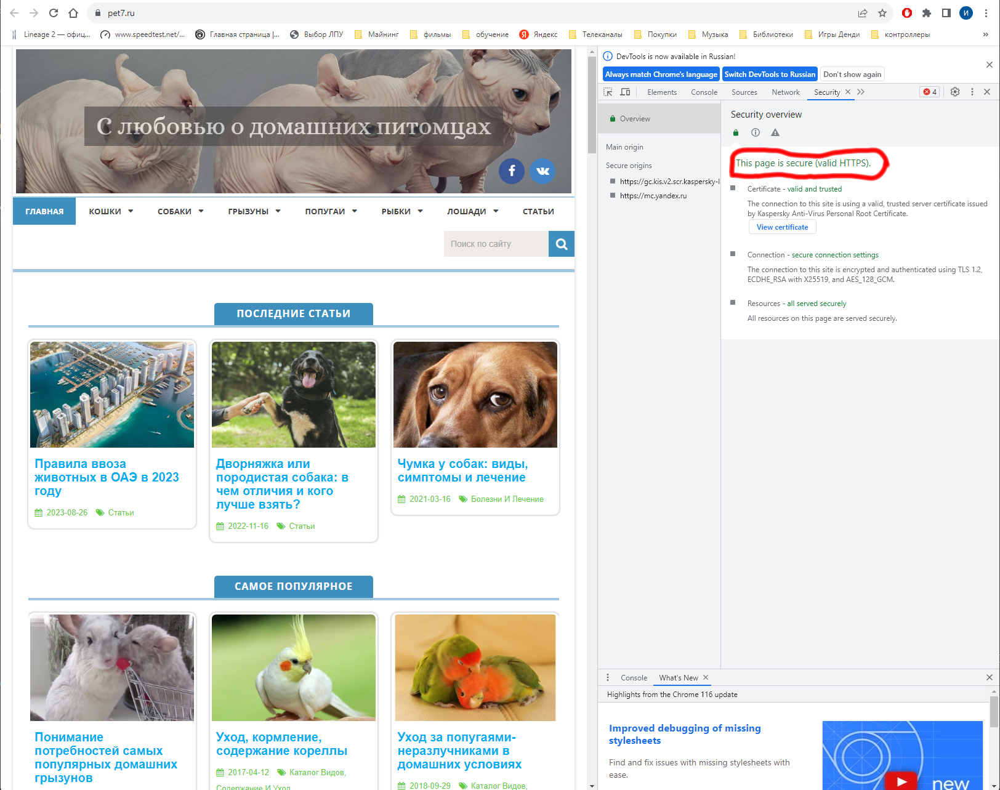

# Знакомство с web технологиями

---

## Урок 1.  Веб-технологии: вчера, сегодня, завтра

Задача: на основе сайта https://pet7.ru/
- Определите, на каком протоколе работает сайт.
- Проанализируйте структуру страницы сайта. Покажите в коде где хедер, футер и контент.
- Внесите не менее 3 изменений на страницу с помощью инструмента разработчика и представьте скриншоты было/стало.
- Создайте прототип низкой детализации.
  
  ---

  # Решение

## **1 Определите, на каком протоколе работает сайт.**
 
- Сайт работает на протоколе защищенном протоколе https:
  

## **2 Проанализируйте структуру страницы сайта. Покажите в коде где хедер, футер и контент.**

- Заголовок (Header):
  

- Контент (Content):
  

- Подвал (Footer):
  

## **3 Внесите не менее 3 изменений на страницу с помощью инструмента разработчика и представьте скриншоты было/стало.**

- было:
  
- стало:
  
  - изменен текст элемента;
  - изменен цвет фона;
  - изменен цвет шрифта;
  - добавлено скругление (border-radius) величиной 10 пикселей.

## **4 Создайте прототип низкой детализации.**

- прототип низкой детализации, включающий Header, Content, Footer:
  